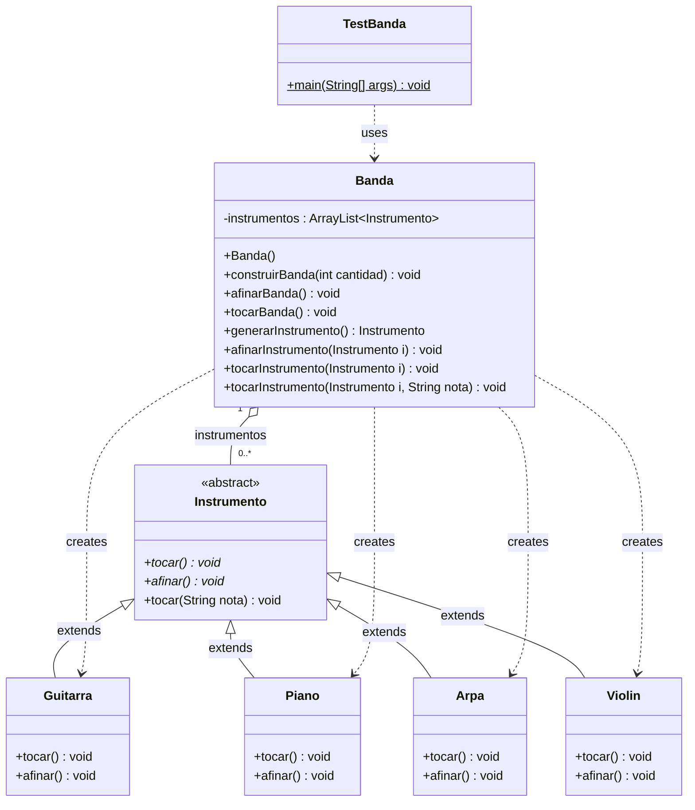

# BandaAleatoria

Ejemplo de banda aleatoria en java

```mermaid
classDiagram
    class Instrumento {
        <<abstract>>
        +tocar()* void
        +afinar()* void
        +tocar(String nota) void
    }

    class Guitarra {
        +tocar() void
        +afinar() void
    }

    class Piano {
        +tocar() void
        +afinar() void
    }

    class Arpa {
        +tocar() void
        +afinar() void
    }

    class Violin {
        +tocar() void
        +afinar() void
    }

    class Banda {
        -instrumentos : ArrayList~Instrumento~
        +Banda()
        +construirBanda(int cantidad) void
        +afinarBanda() void
        +tocarBanda() void
        +generarInstrumento() Instrumento
        +afinarInstrumento(Instrumento i) void
        +tocarInstrumento(Instrumento i) void
        +tocarInstrumento(Instrumento i, String nota) void
    }

    class TestBanda {
        +main(String[] args)$ void
    }

    Instrumento <|-- Guitarra : extends
    Instrumento <|-- Piano : extends
    Instrumento <|-- Arpa : extends
    Instrumento <|-- Violin : extends

    Banda "1" o-- "0..*" Instrumento : instrumentos
    Banda ..> Guitarra : creates
    Banda ..> Piano : creates
    Banda ..> Arpa : creates
    Banda ..> Violin : creates
    TestBanda ..> Banda : uses
```