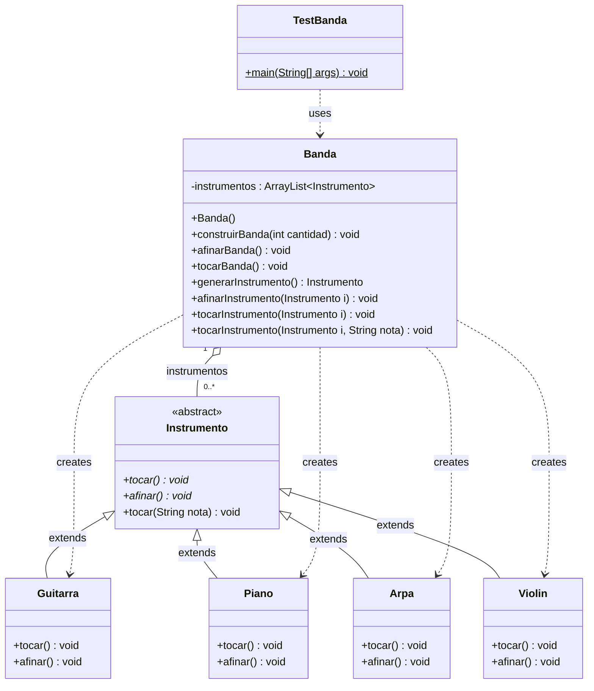

# BandaAleatoria

Ejemplo de banda aleatoria en java

## Resumen de la estructura 
| Clase | Tipo | Descripción |
|---|---|---|
| **[Instrumento](cci:2://file:///c:/Users/apdaz/dev/patrones/BandaAleatoria/src/bandaaleatoria/Instrumento.java:11:0-20:1)** | `abstract class` | Clase base abstracta. Define los métodos abstractos [tocar()](cci:1://file:///c:/Users/apdaz/dev/patrones/BandaAleatoria/src/bandaaleatoria/Instrumento.java:16:4-18:5) y [afinar()](cci:1://file:///c:/Users/apdaz/dev/patrones/BandaAleatoria/src/bandaaleatoria/Instrumento.java:14:4-14:34), y un método concreto [tocar(String nota)](cci:1://file:///c:/Users/apdaz/dev/patrones/BandaAleatoria/src/bandaaleatoria/Instrumento.java:16:4-18:5). |
| **[Guitarra](cci:2://file:///c:/Users/apdaz/dev/patrones/BandaAleatoria/src/bandaaleatoria/Guitarra.java:11:0-19:1)**, **[Piano](cci:2://file:///c:/Users/apdaz/dev/patrones/BandaAleatoria/src/bandaaleatoria/Piano.java:11:0-19:1)**, **[Arpa](cci:2://file:///c:/Users/apdaz/dev/patrones/BandaAleatoria/src/bandaaleatoria/Arpa.java:11:0-19:1)**, **[Violin](cci:2://file:///c:/Users/apdaz/dev/patrones/BandaAleatoria/src/bandaaleatoria/Violin.java:11:0-19:1)** | `class` | Clases concretas que extienden [Instrumento](cci:2://file:///c:/Users/apdaz/dev/patrones/BandaAleatoria/src/bandaaleatoria/Instrumento.java:11:0-20:1) e implementan [tocar()](cci:1://file:///c:/Users/apdaz/dev/patrones/BandaAleatoria/src/bandaaleatoria/Instrumento.java:16:4-18:5) y [afinar()](cci:1://file:///c:/Users/apdaz/dev/patrones/BandaAleatoria/src/bandaaleatoria/Instrumento.java:14:4-14:34). |
| **[Banda](cci:2://file:///c:/Users/apdaz/dev/patrones/BandaAleatoria/src/bandaaleatoria/Banda.java:15:0-75:1)** | `class` | Contiene un `ArrayList<Instrumento>`. Usa un **Factory Method** ([generarInstrumento()](cci:1://file:///c:/Users/apdaz/dev/patrones/BandaAleatoria/src/bandaaleatoria/Banda.java:46:4-59:5)) que crea instrumentos aleatorios con `Random`. Gestiona la afinación y ejecución de toda la banda. |
| **[TestBanda](cci:2://file:///c:/Users/apdaz/dev/patrones/BandaAleatoria/src/bandaaleatoria/TestBanda.java:13:0-28:1)** | `class` | Clase de prueba con [main()](cci:1://file:///c:/Users/apdaz/dev/patrones/BandaAleatoria/src/bandaaleatoria/TestBanda.java:15:4-26:5). Genera una cantidad aleatoria de instrumentos, construye la banda, la afina y la hace tocar. |